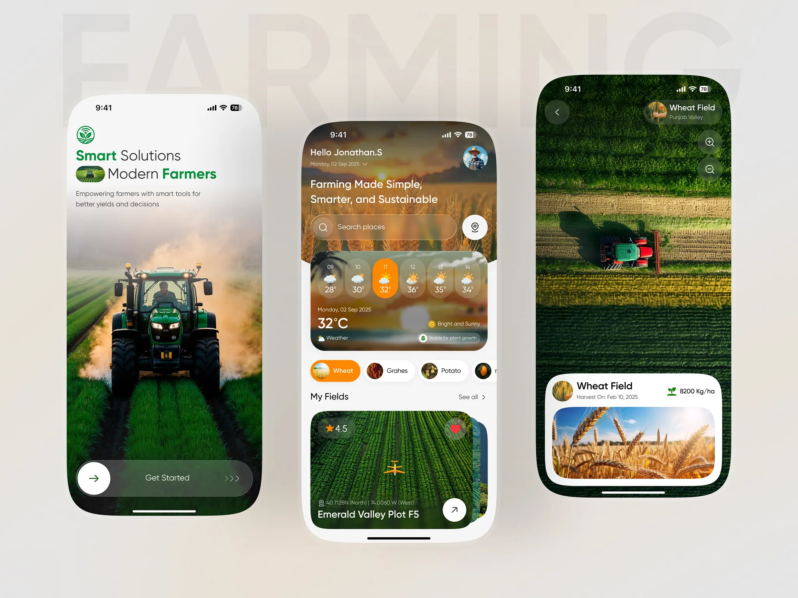
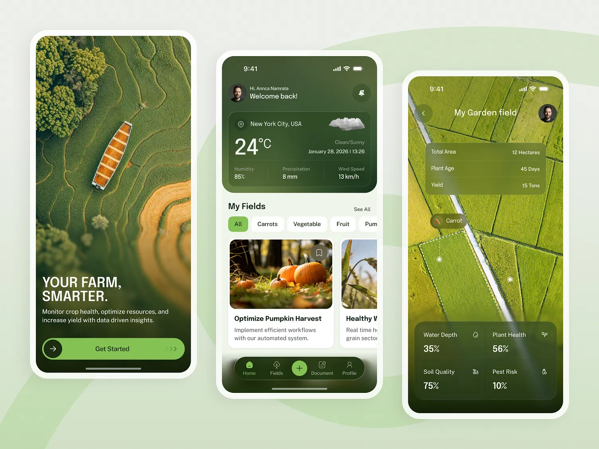
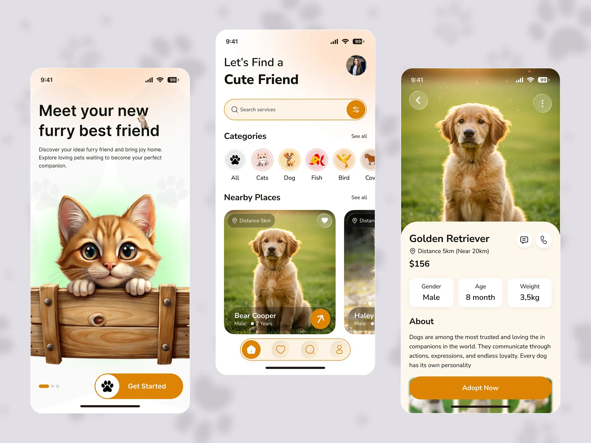
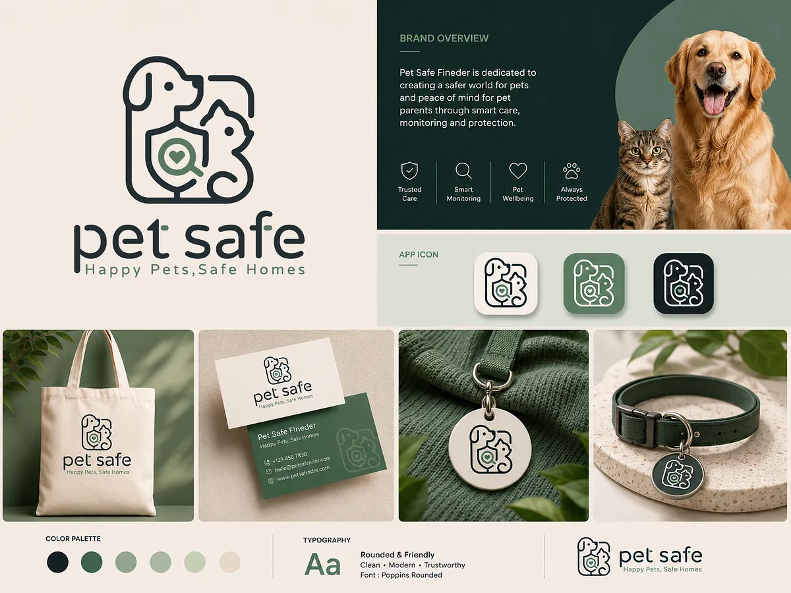

# Pawtrol

## Présentation du projet

Pawtrol est une application Flutter dont l'objectif est la reconnaissance d’animaux et l'obtention d’informations sur ces derniers.

A partir d'une photo prise ou sélectionnée galerie, Gemini
identifier l'animal et une API récupère des informations. L'observation est ensuite enregistrée avec sa position.

Les observations sont en premier lieu conservées localement avec Isar (ce qui permet un enregistrement hors connexion). Elles sont ensuite
synchronisées vers Firestore dès que possible.

## Fonctionnalités principales

- création de compte et connexion par e-mail/mot de passe
- suppression de compte
- prise de photo avec la caméra ou sélection depuis la galerie
- identification de l'animal par analyse d'image avec Firebase AI / Gemini
- récupération des informations de l'animal avec API Ninjas
- récupération optionnelle d'une image illustrative via un appel à l'API `animals.maxz.dev`
- récupération de la position courante avec `geolocator`
- stockage local hors ligne avec Isar
- synchronisation des observations et suivi de l'état réseau
- consultation de la galerie des observations, de statistiques sur les observations, et du profil utilisateur

## Installation

### Prérequis

- Flutter installé et disponible dans le `PATH`
- Dart compatible avec `^3.13.3`
- Android Studio et un SDK Android pour Android
- Xcode et CocoaPods pour iOS/macOS
- un appareil physique ou un émulateur autorisant caméra, galerie et géolocalisation
- un projet Firebase configuré pour les plateformes ciblées
- une clef API Ninjas pour les informations sur les animaux

La configuration Android utilise Java 17, Kotlin 2.4.0 et Android Gradle Plugin
9.1.0.

### Installation

#### 1. Récupérer le projet

```bash
git clone <url-du-depot>
cd pawtrol
flutter pub get
```

#### 2. Configurer Firebase

Créer ou sélectionner un projet dans la [console Firebase](https://console.firebase.google.com/),
puis activer Authentication avec le fournisseur **Email/Password**, Cloud
Firestore, Firebase AI / l'accès au modèle Gemini et App Check pour la
production.

Les fichiers de configuration natifs attendus sont `android/app/google-services.json`
et `ios/Runner/GoogleService-Info.plist`. Ils doivent correspondre au projet
Firebase ciblé. Avant un déploiement, configurer les règles Firestore afin que
chaque utilisateur accède uniquement à ses propres données.

```
rules_version = '2';

service cloud.firestore {
  match /databases/{database}/documents {

    match /users/{userId} {
      allow read, write: if request.auth != null
        && request.auth.uid == userId;
    }

    match /users/{userId}/observations/{observationId} {
      allow read, write: if request.auth != null
        && request.auth.uid == userId;
    }
  }
}
```

#### 3. Configurer la clef API Ninjas

La clef est fournie à la compilation avec la variable `ANIMAL_API_KEY` :

```bash
flutter run --dart-define=ANIMAL_API_KEY=<votre-clef-api-ninjas>
```

S'appuyer sur le document `tool/config/local.example.json` pour créer le fichier `tool/config/local.json` qui doit contenir la clef réelle :

```json
{
  "ANIMAL_API_KEY": "your-api-key"
}
```

##### Depuis Android Studio

1. Ouvrir le projet dans Android Studio
2. Aller dans **Run > Edit
   Configurations...**.
3. Sélectionner la configuration **Flutter** utilisée pour lancer Pawtrol.
4. Dans **Additional run args**, ajouter :

   ```text
   --dart-define-from-file=tool/config/local.json
   ```

5. Vérifier que le champ **Working directory** pointe vers la racine du
   projet, c'est-à-dire le dossier qui contient `pubspec.yaml`.
6. Cliquer sur **Apply**, puis lancer l'application avec le bouton **Run**.

##### Depuis Xcode

1. Générer l'encodage base64 de la définition depuis un terminal situé à la
   racine du projet. Ne pas ajouter de retour à la ligne :

   ```bash
   printf %s 'ANIMAL_API_KEY=<votre-clef-api-ninjas>' | base64
   ```

2. Ouvrir `ios/Runner.xcworkspace` dans Xcode, puis sélectionner le projet
   **Runner** dans le navigateur.
3. Sélectionner la cible **Runner**, ouvrir **Build Settings**, rechercher
   **User-Defined**, puis ajouter le réglage `DART_DEFINES`.
4. Coller dans sa valeur le résultat base64 obtenu à l'étape 1. Pour plusieurs
   définitions, utiliser des valeurs base64 séparées par des virgules.
5. Dans **Product > Scheme > Edit Scheme... > Run**, vérifier que la cible
   **Runner** et la configuration **Debug** sont sélectionnées, puis lancer
   avec **Run**.

##### VS Code

Il est possible de rajouter l'argument dans `.vscode/launch.json` :

```json
{
  "name": "Pawtrol",
  "request": "launch",
  "type": "dart",
  "args": ["--dart-define-from-file=tool/config/local.json"]
}
```

#### 4. Lancer l'application

```bash
flutter devices
flutter run --dart-define-from-file=tool/config/local.json
```

## Démonstration

A venir...

## Inspiration pour l'UI

Le frontend a été, comme pour les fonctionnalités, entièrement réalisé par mes soins et grâce aux ressources mises à disposition par la communauté.

Pour le faire, je me suis basé sur les travaux suivants :

- [Smart Farming Mobile App](https://dribbble.com/shots/26494275-Smart-Farming-Mobile-App)
  
- [Smart Farming App | Agriculture Farming Mobile App UI](https://dribbble.com/shots/27051609-Smart-Farming-App-Agriculture-Farming-Mobile-App-UI)
  
- [Pet Adoption Mobile App UI/UX](https://dribbble.com/shots/26689629-Pet-Adoption-Mobile-App-UI-UX)
  
- [Pet Safe – Modern Line Art Pet Care Logo & Brand Identity](https://dribbble.com/shots/27673484-Pet-Safe-Modern-Line-Art-Pet-Care-Logo-Brand-Identity)
  
- [Pet food Brand Identity | Pet Care Wellness Branding | Pet logo](https://dribbble.com/shots/27518354-Pet-food-Brand-Identity-Pet-Care-Wellness-Branding-Pet-logo)
  

## Fonctionnement - APIs et services externes

#### Firebase Core et App Check

Firebase est initialisé dans `lib/main.dart`. App Check utilise le fournisseur
Android debug en développement, Play Integrity sur Android en production et le
fournisseur Apple debug dans la configuration actuelle.

#### Firebase Authentication

`lib/src/services/auth_service.dart` utilise Firebase Authentication avec
e-mail/mot de passe pour l'inscription, la connexion et la déconnexion. La
suppression de compte supprime le profil Firestore puis le compte Firebase ;
une réauthentification par mot de passe peut être nécessaire.

#### Firebase AI / Gemini

`lib/src/services/animal_ai_service.dart` utilise le modèle `gemini-3.6-flash`.
L'image JPEG sélectionnée est envoyée au modèle avec l'instruction de renvoyer
uniquement le nom commun anglais. Si aucun animal n'est détecté, le modèle doit
renvoyer `UNKNOWN` et l'analyse échoue.

#### API Ninjas

L'API Ninjas valide et donne des informations sur l'animal identifié :

| Élément                 | Valeur                                         |
| ----------------------- | ---------------------------------------------- |
| Endpoint                | `GET https://api.api-ninjas.com/v1/animals`    |
| Paramètre               | `name=<nom-de-l-animal>`                       |
| Authentification        | en-tête `X-Api-Key`                            |
| Variable de compilation | `ANIMAL_API_KEY`                               |
| Timeout                 | 10 secondes pour connexion, envoi et réception |

Le premier résultat est converti en modèle `Animal`. L'étape peut échouer si l'API renvoie une réponse vide, si la
clef est absente ou s'il y a une erreur HTTP.

#### API d'image animale

Une image aléatoire peut être demandée depuis
`GET https://animals.maxz.dev/api/{animal}/random`. Le nom est encodé dans
l'URL et la propriété JSON `image` est utilisée. Une erreur réseau renvoie
`null`.

#### Géolocalisation et données

- `geolocator` récupère la position au moment de la sauvegarde ; elle peut être
  absente si l'autorisation est refusée ;
- Isar conserve localement les observations et leur état de synchronisation ;
- les profils sont stockés dans `users/{userId}` ;
- les observations sont stockées dans `users/{userId}/observations/{remoteId}` ;
- aucune image n'est envoyée dans Firebase Storage : Firestore conserve son
  chemin local.

Une observation contient notamment `remoteId`, `animalName`, `imagePath`,
`latitude`, `longitude`, `createdAt` et `synchronizedAt`.

## Structure principale

```text
lib/
	main.dart                         Initialisation Firebase et démarrage
	src/
		services/                       APIs, authentification et synchronisation
		repositories/                   Accès aux données locales
		data/local/                     Base Isar et modèles générés
		providers/                      État Riverpod
		views/                          Écrans de l'application
		widgets/                        Composants réutilisables
tool/config/
	local.example.json                Exemple de configuration locale
android/                            Configuration Android et Firebase
ios/                                Configuration iOS et Firebase
assets/images/                      Ressources graphiques
```
